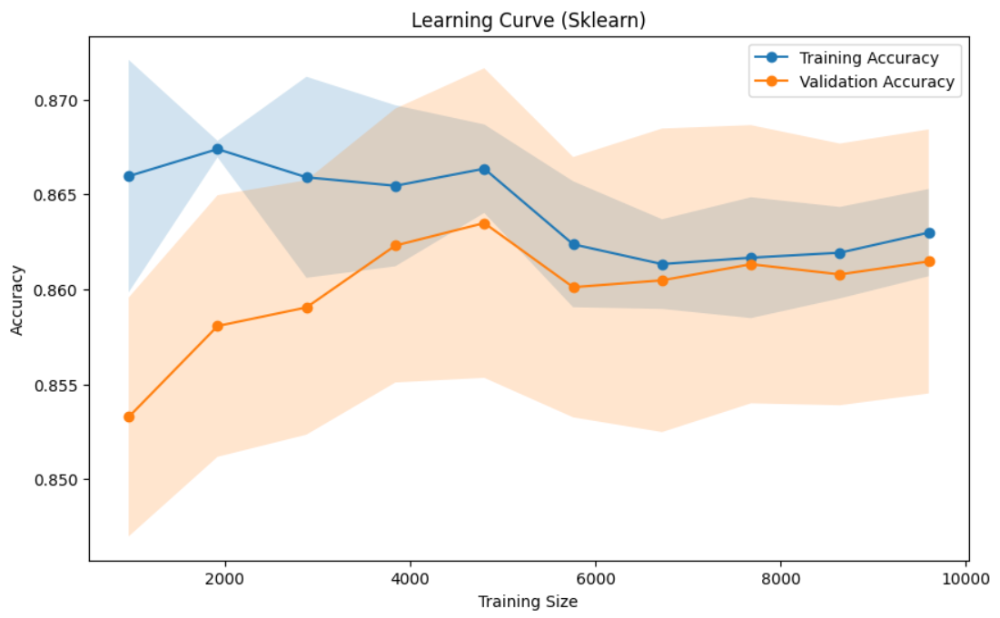

# Модель прогнозирования курения

## Обзор
Данный репозиторий содержит модель машинного обучения, которая прогнозирует статус курения на основе различных показателей здоровья. Модель использует ансамблевый подход, объединяющий логистическую регрессию и случайный лес, с оптимизацией гиперпараметров с помощью Optuna.

## Производительность модели


Как видно из графика кривой обучения:
- Модель достигает стабильной точности около 86%
- Тренировочная и валидационная точности близки друг к другу, что указывает на хороший баланс (отсутствие переобучения)
- Производительность стабилизируется после примерно 4000 образцов
- Малый разрыв между тренировочной и валидационной точностью указывает на хорошую обобщающую способность модели

## Функциональность
- Инженерия признаков, включая расчет ИМТ и другие метрики здоровья
- Генерация полиномиальных признаков для сложных взаимодействий
- Ансамблевое обучение, сочетающее логистическую регрессию и случайный лес
- Оптимизация гиперпараметров с использованием Optuna
- Стандартизированная предобработка данных
- Оценка по метрике ROC-AUC

## Набор данных
Модель требует следующие входные файлы:
- `train.csv`: Обучающий набор данных
- `test.csv`: Тестовый набор данных
- `sample_submission.csv`: Образец формата подачи результатов

### Входные признаки
Модель использует различные показатели здоровья, включая:
- Рост (см)
- Вес (кг)
- Систолическое давление
- Расслабление (диастолическое давление)
- Уровни холестерина
- Уровни ЛПВП
- Ферменты печени AST и ALT
- Дополнительные сгенерированные признаки:
  - ИМТ (Индекс массы тела)
  - Отношение талии к росту
  - Пульсовое давление
  - Коэффициент холестерина
  - Коэффициент ферментов печени

## Требования
```
pandas
scikit-learn
optuna
numpy
matplotlib
seaborn
```

## Установка
1. Клонируйте репозиторий
```bash
git clone <url-репозитория>
```

2. Установите необходимые пакеты
```bash
pip install -r requirements.txt
```

## Использование
1. Поместите ваши файлы данных (`train.csv`, `test.csv`, `sample_submission.csv`) в директорию проекта

2. Запустите модель:
```python
python smoking_prediction_model.py
```

## Архитектура модели
Решение реализует двухэтапный подход:

1. **Инженерия признаков**
   - Расчет ИМТ
   - Создание полиномиальных признаков
   - Стандартное масштабирование признаков

2. **Ансамблевая модель**
   - Логистическая регрессия (оптимизированные гиперпараметры)
   - Случайный лес (оптимизированные гиперпараметры)
   - Мягкое голосование для финальных предсказаний

## Процесс обучения модели
1. Предобработка данных и инженерия признаков
2. Разделение на обучающую и тестовую выборки (80-20)
3. Оптимизация гиперпараметров с помощью Optuna
   - Параметры логистической регрессии:
     - Значение C
     - Тип решателя
     - Максимальное количество итераций
   - Параметры случайного леса:
     - Количество деревьев
     - Максимальная глубина
     - Минимальное количество образцов для разделения

## Анализ модели
Репозиторий включает инструменты разведочного анализа данных:
- Кривые обучения для визуализации производительности модели (см. график выше)
- Анализ весов доказательств (WoE) для возрастных категорий
- Оценка по метрике ROC-AUC

## Участие в разработке
Не стесняйтесь открывать issues или отправлять pull requests для улучшений.